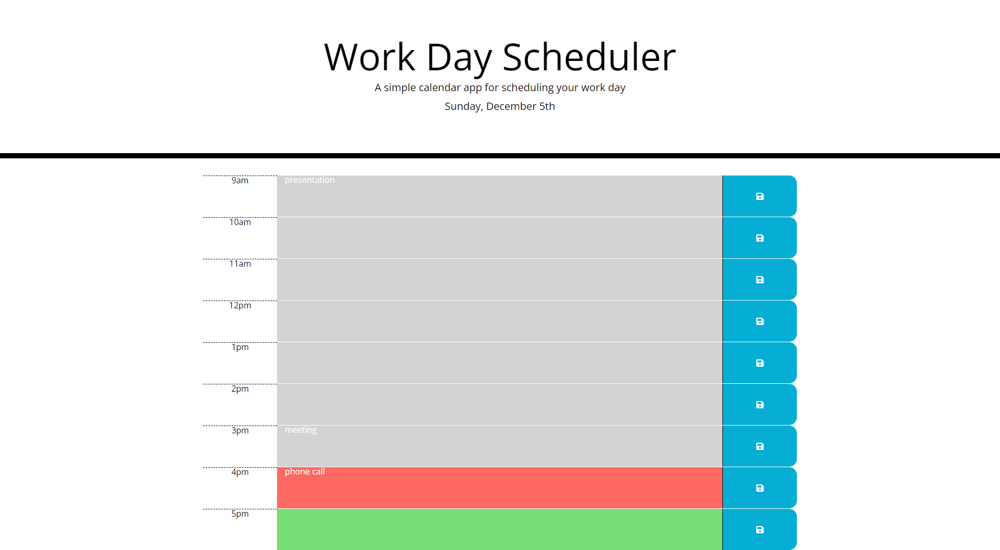

# Workday Scheduler
## Description
#### Daily Work Scheduler
This workday scheduler provides teh ability to edit tasks for each hour of the work day. When users enter a task and click the Save button the tasks will be saved upon reload of the page. Hour timeblocks are color coded against the current hour of the day to represent past, present, and future tasks.  

## Screenshot

## URL
https://knharman.github.io/workday-scheduler/ 
